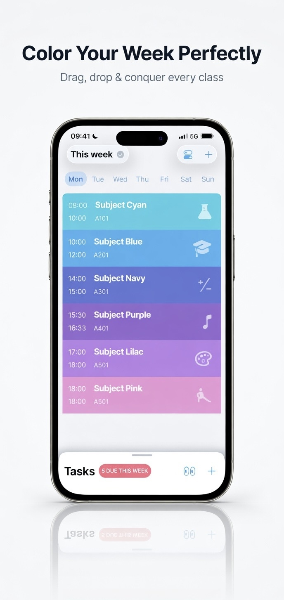
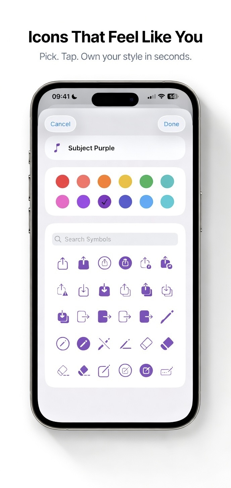
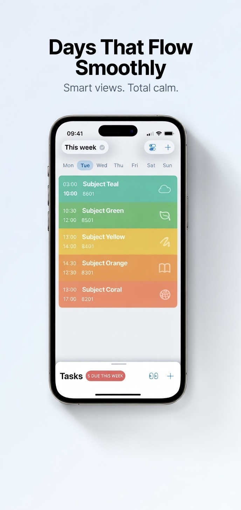
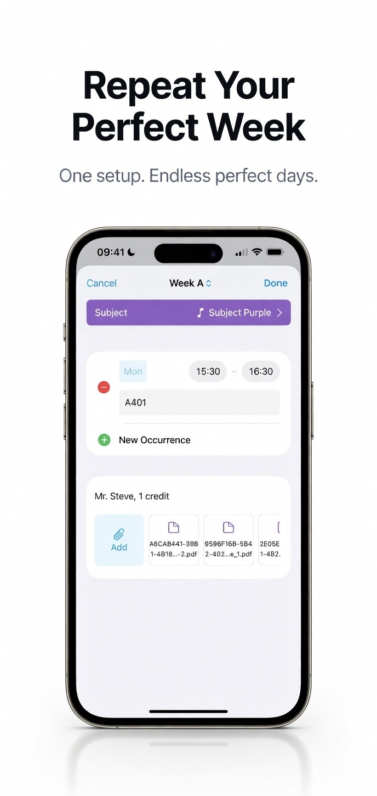
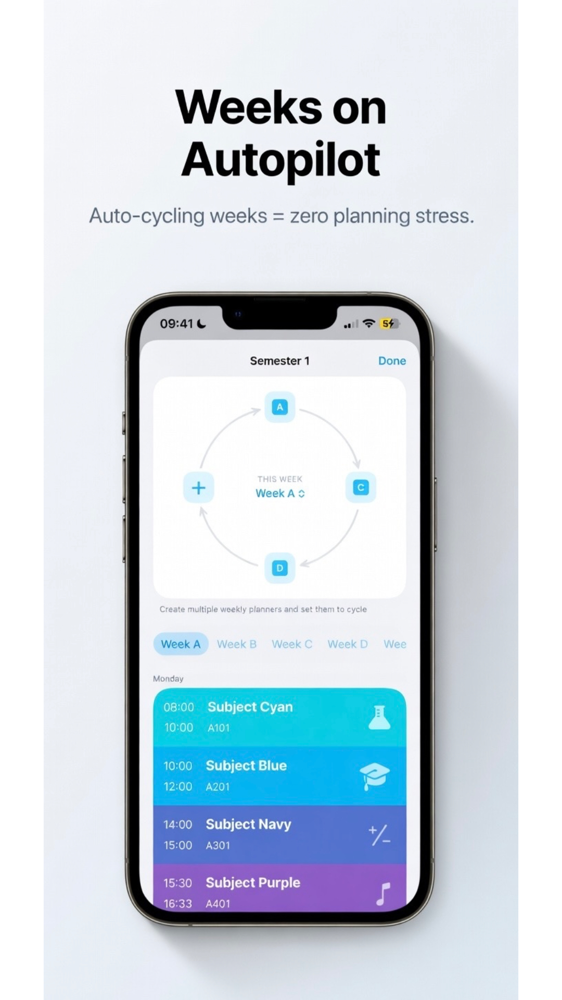
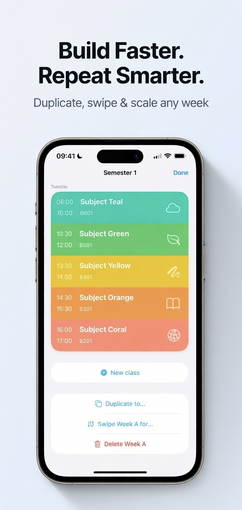
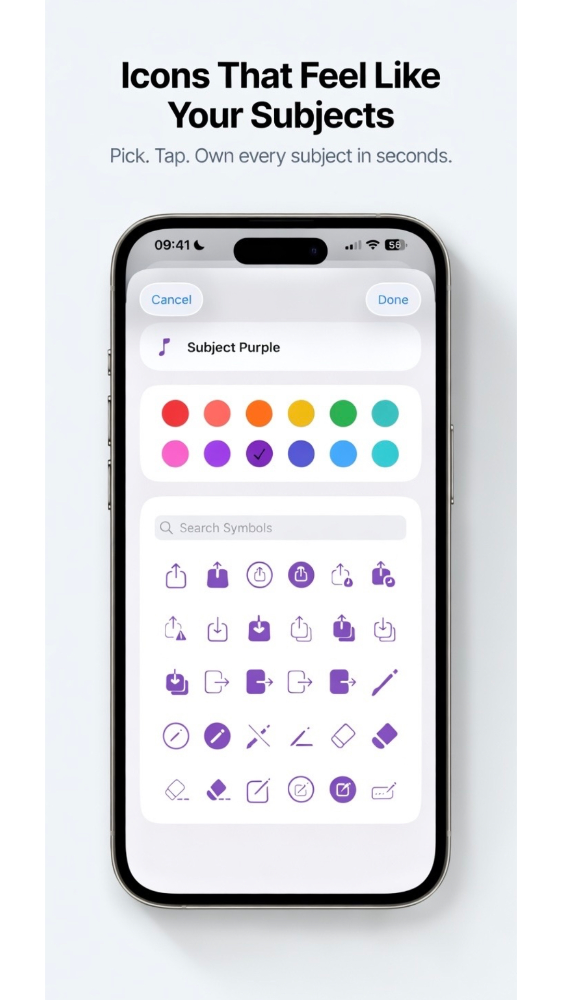
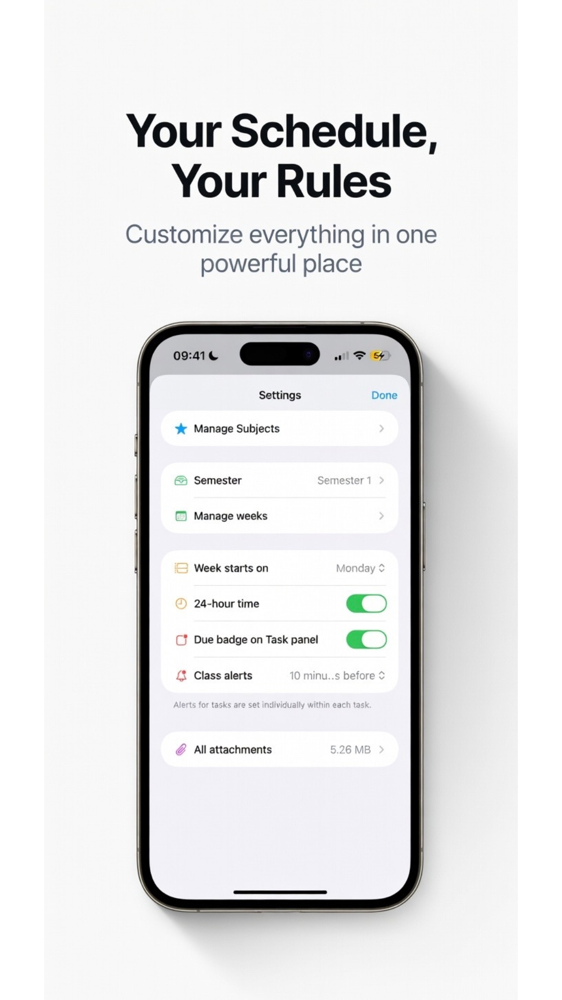
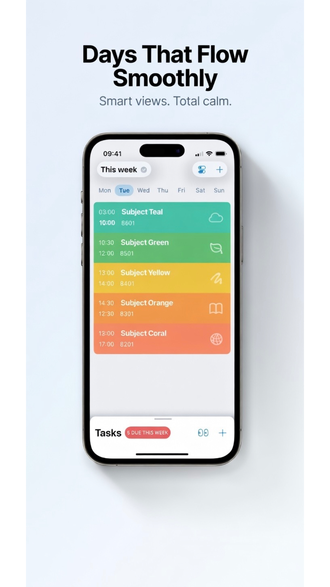

# 📅 Elevate Planner: Smarter Academic Organizer

Elevate Planner is a modern iOS app for students and educators to plan, track, and excel in their coursework. With a dynamic, color-coded timetable, powerful task management, and robust customization table puts you in control of your academic schedule—whether your semester is straightforward or follows complex rotating weeks!

---
## 📸 App Store Screenshots

  
  
  
  
  
  
  
  
  

---
## ✨ Features

- **Dynamic Timetable:** Clear, color-coded weekly schedules for instant clarity.
- **Task Management:** Built-in task tracker with “Due This Week” badges, overdue and completed sorting.
- **Rotating Weeks:** Seamless support for weekly cycles (Week A/B/C/D)—great for non-standard schedules.
- **Deep Customization:** Personalize subjects with custom colors, names, and a wide collection of SF Symbols.
- **File Management:** Attach PDFs and files directly to classes or subjects; supports iCloud integration.
- **Semester Setup:** Effortlessly manage terms and semesters, switch views as needed.
- **Notifications:** Receive timely alerts for upcoming classes and task deadlines.

---
## 📋 Requirements

- **iOS 17.0** or later
- Xcode 15 or newer
